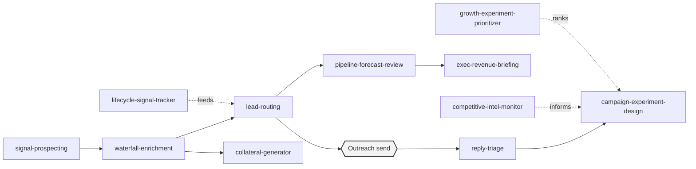

# GTM Engineer OS

A Claude Code operating system built for a GTM Engineer / Growth Engineer / RevOps Engineer role: the systems a GTM Engineer builds and runs, not a description of them.

The GTM Engineer job is closer to "part AE, part sales engineer, part data engineer" than a marketing role: the output is pipeline, generated and moved by systems, not campaigns run by hand. This repo is 15 of those systems, 12 pipeline and ops skills plus 3 cross-cutting controls, each specified with real decision logic (scoring formulas, thresholds, gates), not prompt filler.

## System map

This isn't 15 unrelated skills. It's a pipeline, with a few supporting skills that inform decisions inside it, plus three controls that sit underneath the whole flow rather than in it:

`crm-hygiene-audit` runs underneath all of this. It's the data-integrity check that keeps the pipeline's inputs (dedup, field quality) trustworthy, not a step in the outreach flow itself.

Three more controls sit under the whole flow, not in it. `live-action-approval-gate` is the hold every live send, bulk CRM write, and spend change passes through before it fires (the `Outreach send` node above is one of them). `spend-and-cost-guard` keeps every paid step (enrichment, research, generation) proportional to account fit before it runs. `proof-boundary` stamps the truth-status on every number the reporting skills produce, so a forecast never reaches the board labelled as booked.

## The skills

| Skill | What it does | Category |
|---|---|---|
| `signal-prospecting` | Job-change/funding/hiring/tech-change signal detection with time-windowed outreach logic and multi-signal scoring tiers | Pipeline generation |
| `waterfall-enrichment` | ICP-gate-before-spend, then a sequential multi-provider enrichment waterfall with per-lead credit logging | Pipeline generation |
| `crm-hygiene-audit` | Weighted A-F data/pipeline health score across 5 dimensions, dual-pass dedup, plan→baseline→execute→verify scaffold | Data ops |
| `lead-routing` | Lifecycle state machine, dual-dimension (fit + engagement) scoring, 4-method routing tree, SLA escalation | Data ops |
| `reply-triage` | 11-label reply taxonomy, positive-reply-rate thresholds, hostile/unsubscribe auto-pause safety rule | Campaign ops |
| `campaign-experiment-design` | Single-variable A/B discipline: sample-size gating, pre-declared success criteria, confidence-weighted results | Campaign ops |
| `pipeline-forecast-review` | Commit/Best-Case/Pipeline/Upside forecast tiering, KPI guardrails, fetch→score→prioritize weekly review | Reporting |
| `exec-revenue-briefing` | Story-spine board/exec output, KPI stack, "no orphaned bad news" and "no surprises" rules | Reporting |
| `competitive-intel-monitor` | Multi-verb command surface, 8-dimension tracking, diff-only recurring monitor, evidence-citation requirement | Market intelligence |
| `growth-experiment-prioritizer` | ICE/RICE scoring engine + CAC/LTV/payback channel-evaluation framework, ranked backlog output | Market intelligence |
| `lifecycle-signal-tracker` | Post-sale churn-risk taxonomy + time-to-value pace-multiplier, both risk and expansion signals in one skill | Retention |
| `collateral-generator` | Row-by-row personalized document generation with a mandatory generate-then-validate loop and no-fabrication rule | Content at scale |
| `proof-boundary` | Truth-status label (measured/projected/assumed/drafted) on every reported number; blocks a forecast shown as booked and an untraceable attribution claim | Control |
| `live-action-approval-gate` | Unconditional hold on every live send, bulk/irreversible CRM mutation, and spend change; classifies run-freely vs must-gate | Control |
| `spend-and-cost-guard` | Cross-cutting cost control under every paid step: fit-gate before spend, freshness cache, key rotation, per-account spend ledger | Control |

## Why this shape, and where it came from

I didn't invent 15 skills from a blank page. I mapped the real recurring tasks a GTM Engineer does (researched against 2025-2026 job postings, Clay's own "what is a GTM engineer" framing, and hiring-manager commentary on what separates a strong candidate from a button-clicker), then found the best existing public Claude Code skill pattern for each task and adapted it, the same way I'd actually build this on the job: don't reinvent a wheel that already has real decision logic behind it.

Every skill's SKILL.md has an explicit "Adapted from" note naming its real source. The sources, by name:

- **ColdIQ's GTM Skills** (`sachacoldiq/ColdIQ-s-GTM-Skills`): signal-windowed prospecting and 3-layer ICP scoring, from an agency that ran real outbound campaigns
- **getaero's gtm-eng-skills** (`getaero-io/gtm-eng-skills`): multi-provider account sourcing and dedup ("build-tam")
- **wreynoir's company-enrichment-skill**: the spend-gate-before-enrichment pattern
- **elijeangilles's revops-skills**: weighted A-F CRM health scoring
- **TomGranot's hubspot-admin-skills** (32 skills): dual-pass dedup and the plan→baseline→execute→verify scaffold
- **coreyhaines31's marketingskills**: lead lifecycle state machine and routing decision tree
- **growthenginenowoslawski's coldoutboundskills**: reply-classification taxonomy and A/B experiment discipline
- **gtmagents' gtm-agents**: forecast-tiering methodology and exec-briefing story-spine
- **amplemarket's skills**: fetch→score→prioritize pipeline-review mechanic
- **alirezarezvani's claude-skills** and **mohitagw15856's pm-claude-skills**: competitive-intel command structure and diff-only monitoring
- **deanpeters's Product-Manager-Skills**: ICE/RICE and CAC/LTV/payback formulas
- **t0ddc3by's claude-for-customer-success** (81 skills): churn root-cause taxonomy and TTV pace-multiplier
- **Anthropic's official skills repo**: the generate-then-validate document pattern

Where no adaptable public pattern existed (`collateral-generator`'s row-by-row personalization at scale), the skill says so directly instead of pretending a source exists.

The three controls carry their own sourcing. `live-action-approval-gate`'s hold is adapted from **HumanLayer**'s human-in-the-loop approval pattern and the Claude Code `PreToolUse` gate. `spend-and-cost-guard`'s fit-gate reuses the same **wreynoir/company-enrichment-skill** MATCH-before-spend pattern that `waterfall-enrichment` cites, generalized to every paid step; its key rotation and per-account ledger are my own design and say so. `proof-boundary`'s truth-status label carries the provenance idea from my lead-gen system repos, and its never-show-a-forecast-as-booked rule is my own. These are the same two or three controls I put under every operating system I build, pointed here at a revenue pipeline.

## Tool leverage

Every skill states its intended integrations (the real tools it would connect to) without wiring them live. That wiring happens once the role is actually landed, not before. Stated integration points across the repo:

| Category | Tools named |
|---|---|
| Enrichment/prospecting | Clay, Apollo, Hunter, ZoomInfo, LeadMagic, LinkedIn Sales Navigator API |
| CRM/data | HubSpot API, Salesforce API/SOQL |
| Sequencing/campaigns | Smartlead, Instantly, Apollo sequences, Unipile |
| Reporting/BI | A data warehouse, HubSpot/Salesforce reporting API |
| Documents | Google Slides/Docs API, a docx-generation library, Qwilr/PandaDoc |
| Product/lifecycle | Product-usage telemetry (e.g. Amplitude), a support-ticket system |

## Repo structure

- `CLAUDE.md`: operator identity, operating principles, file map
- `context/goals.md`: my real goals for this search
- `context/role-target.md`: swappable per-application file (who I'd support, first-90-days plan, honest fit assessment)
- `context/people/`: fictional stakeholders at a worked-example company, **Rivergate Data** (a Series A B2B SaaS company), used across every skill's worked examples for continuity
- `context/decisions-log.md`: fictional seeded decisions showing the skills in use
- `.claude/skills/`: the 15 skills above (12 pipeline/ops + 3 controls)

The scenario company and its people are fictional. My goals, the skill design, and the sourcing are real.
